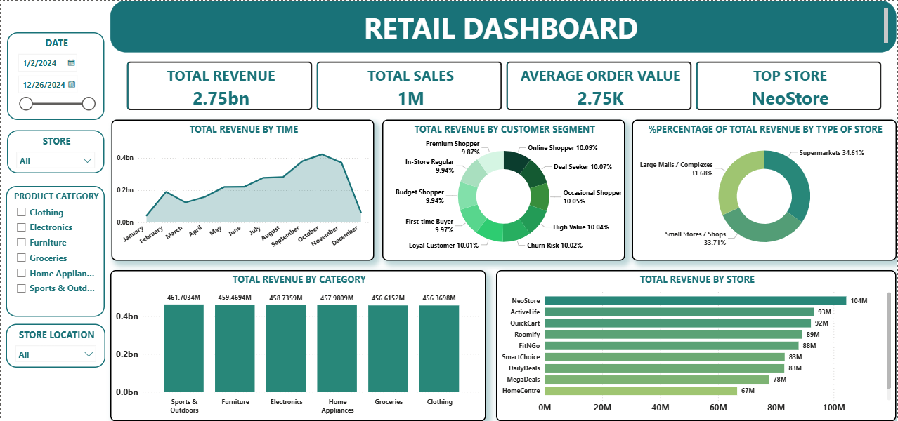

# 🛒 Retail Data Analysis Project

## 📌 Project Overview
This project is an **end-to-end retail data analytics project** that demonstrates how raw transactional data can be transformed into actionable business insights using a modern data stack.

The project covers the full workflow:
- Data preparation & cleaning with **Python (Pandas)**
- Data modeling and storage in **MySQL (Star Schema)**
- Analytical querying with **SQL**
- Interactive dashboarding and visualization using **Power BI**

The final output is a **business-ready Power BI dashboard** that helps stakeholders understand sales performance, product trends, store effectiveness, and campaign impact.

---

## 🏗️ Architecture & Workflow
CSV Files
->
Python (Jupyter Notebook)
-> Data Cleaning & Standardization
->
MySQL(Data Warehouse - Star Schema)
-> SQL Analytics
Power BI Dashboard

## 🧩 Dataset Description
Data source: 
https://www.kaggle.com/datasets/shrinivasv/retail-store-star-schema-dataset

The dataset follows a **Star Schema** design.

### 🔹 Fact Table
**fact_sales** – transactional sales data  
- sales_sk  
- sales_id  
- customer_sk  
- product_sk  
- store_sk  
- salesperson_sk  
- campaign_sk  
- sales_date  
- total_amount  

### 🔹 Dimension Tables
- **dim_customers** – customer information  
- **dim_products** – product details and categories  
- **dim_stores** – store attributes  
- **dim_salespersons** – sales staff information  
- **dim_campaigns** – marketing campaign details  

This structure supports efficient analytical queries and Power BI modeling.

---

## Python (Data Processing)

Python is used for:
- Reading raw CSV files
- Checking and standardizing data types
- Converting date columns to proper datetime formats
- Ensuring surrogate keys consistency
- Loading cleaned data into MySQL

**Key libraries:**
- pandas  
- sqlalchemy  
- pymysql  
- matplotlib
- seaborn

All data preparation steps are documented in **Jupyter Notebooks** for transparency and reproducibility.

---

## MySQL (Data Warehouse)

MySQL is used as the **analytical database layer**:
- Database name: `retail_db`
- Tables created with optimized data types
- Indexes added for high-performance analytical queries
- Data loaded from Python using SQLAlchemy

The database is designed for **read-heavy analytical workloads**.

---

## Power BI (Visualization & Insights)

Power BI connects directly to MySQL and is used to:
- Build relationships between fact and dimension tables
- Create reusable DAX measures (Revenue, AOV, Top Performers)
- Design interactive dashboards with slicers and filters

## Dashboard Preview
